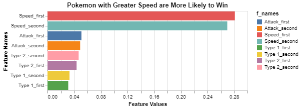
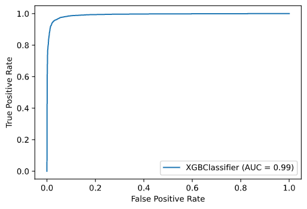

# poke_predict
> The objective of this project is to predict which of two pokemon is going to win in a given fight.   

## Data
> Data used for this project was found on Kaggle at this [link](https://www.kaggle.com/terminus7/pokemon-challenge). You can view all three datasets below:
 - [Pokemon](pokemon.csv)
 - [Combat](combats.csv)
 - [Tests](tests.csv)

 ## Methods
> I used pandas and numpy for data wrangling and altair for my visualization tool.  For my model I used the xgboost classifier since it works really well on these types of datasets and requires very little fine tuning in this instance. 
```python
#%% Import data and libraries
import pandas as pd
import numpy as np
import altair as alt

from xgboost import XGBClassifier

from sklearn import metrics
from sklearn.model_selection import train_test_split
```
## Results




|           |         0.0 |         1.0 |   accuracy |    macro avg |   weighted avg |
|:----------|------------:|------------:|-----------:|-------------:|---------------:|
| precision |    0.964667 |    0.957936 |   0.961467 |     0.961302 |       0.961477 |
| recall    |    0.961977 |    0.9609   |   0.961467 |     0.961439 |       0.961467 |
| f1-score  |    0.96332  |    0.959416 |   0.961467 |     0.961368 |       0.96147  |
| support   | 7890        | 7110        |   0.961467 | 15000        |   15000        |